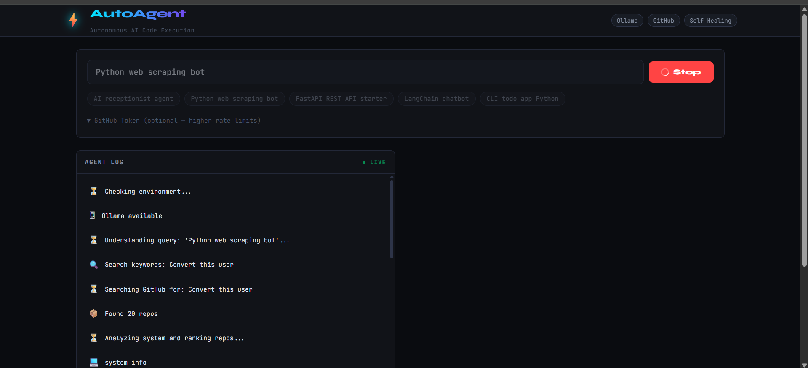
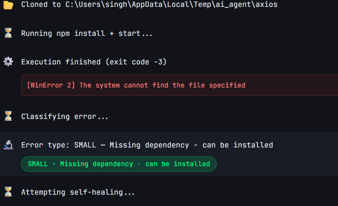
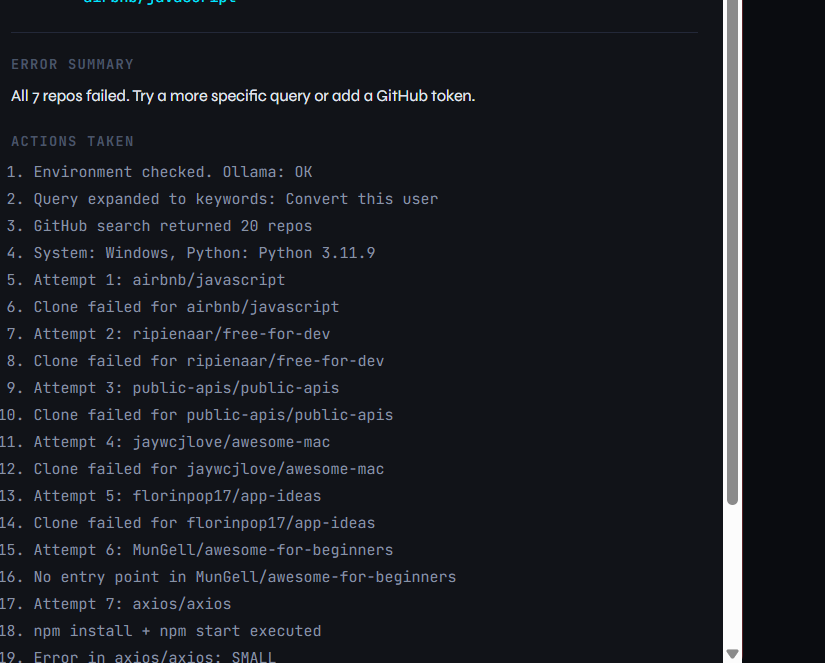
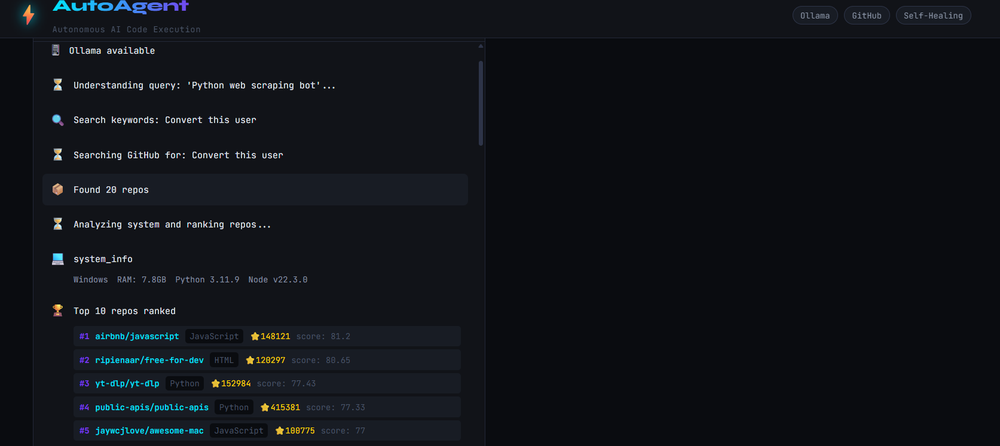

# ⚡ AutoAgent — Autonomous AI Code Execution Agent

A production-ready MVP that searches GitHub for open-source projects matching your query, clones them, runs them in an isolated local sandbox, and **automatically fixes small errors** — all powered by a local Ollama LLM.

---
## System Flow (Live)



## Error Classification Output





## Live Logs & Execution



## Architecture

```
User Query
    │
    ▼
┌─────────────────────────────────────────────────────────┐
│                    FastAPI Backend                       │
│                                                         │
│  1. Query Understanding  ──► Ollama (llama3.1:8b)       │
│  2. GitHub Search        ──► GitHub REST API             │
│  3. Repo Ranking         ──► Score algorithm             │
│  4. System Compatibility ──► psutil + shutil             │
│  5. Clone + Sandbox      ──► git + venv + subprocess     │
│  6. Execute              ──► python / node               │
│  7. Error Classification ──► signal matching + Ollama    │
│  8. Self-Healing         ──► pip install + retry         │
│                                                         │
└─────────────────────────────────────────────────────────┘
    │  NDJSON stream
    ▼
┌─────────────────┐
│  React Frontend │  (live event feed + result panel)
└─────────────────┘
```

---

## Prerequisites

| Tool | Version | Purpose |
|------|---------|---------|
| Python | ≥ 3.10 | Backend runtime |
| Node.js | ≥ 18 | Frontend |
| Git | any | Cloning repos |
| Ollama | latest | Local LLM |

---

## Quick Start

### 1. Install & Start Ollama

```bash
# Install Ollama: https://ollama.com/download
ollama serve                    # Start daemon
ollama pull llama3.1:8b         # Primary model (~5GB)
ollama pull mistral:7b-instruct # Fallback model
ollama pull phi3:mini           # Lightweight fallback
```

### 2. Backend

```bash
cd backend
python -m venv venv
source venv/bin/activate        # Windows: venv\Scripts\activate
pip install -r requirements.txt
uvicorn main:app --reload --port 8000
```

Backend runs at: http://localhost:8000

API docs: http://localhost:8000/docs

### 3. Frontend

```bash
cd frontend
npm install
npm start
```

Frontend runs at: http://localhost:3000

---

## One-Shot Start Script

```bash
chmod +x start.sh
./start.sh
```

---

## Usage

1. Open http://localhost:3000
2. Type a query like **"AI receptionist agent"**
3. (Optional) Add a GitHub token for higher rate limits
4. Click **▶ Run**
5. Watch the live agent log stream
6. See the final result panel with status + actions taken

### Example Queries

- `AI receptionist agent`
- `Python web scraping bot`
- `FastAPI REST API starter`
- `LangChain chatbot`
- `CLI todo app Python`
- `Flask REST API`
- `OpenAI voice assistant`

---

## API Reference

### `POST /api/run`

Starts agent execution. Returns a streaming NDJSON response.

**Request body:**
```json
{
  "query": "AI receptionist agent",
  "github_token": "ghp_xxx"  // optional
}
```

**Stream events (NDJSON):**

| Event Type | Description |
|------------|-------------|
| `status` | Step progress message |
| `env_check` | Ollama + model availability |
| `keywords` | Expanded search keywords |
| `github_results` | Raw repo count |
| `system_info` | OS, RAM, Python, Node |
| `ranked_repos` | Top 5 repos with scores |
| `repo_selected` | Chosen repo details |
| `cloned` | Sandbox path |
| `deps_installed` | pip install result |
| `entry_point` | Detected main file |
| `execution_result` | stdout/stderr after run |
| `error_classified` | `SMALL / LARGE / CREDENTIAL` |
| `self_heal` | Fix actions attempted |
| `retry_result` | Second execution result |
| `done` | Final result object |
| `fatal` | Unrecoverable error |

**Final `done` event shape:**
```json
{
  "type": "done",
  "selected_repo": "owner/repo-name",
  "status": "success | failed | needs_credentials",
  "actions_taken": ["...", "..."],
  "fixes_applied": ["Installed missing package: requests"],
  "error_summary": "...",
  "logs": "..."
}
```

---

## Repo Ranking Algorithm

```
score =
  0.30 × stars        (log-scaled, max 30 pts)
  0.20 × recency      (days since last push)
  0.20 × readme       (description quality proxy)
  0.20 × simplicity   (repo size heuristic)
  0.10 × language     (Python/JS = full points)
```

---

## Error Classification

| Type | Examples | Action |
|------|----------|--------|
| `SMALL` | Missing dependency, ImportError, version mismatch | Auto-fix + retry once |
| `LARGE` | Segfault, broken architecture, OOM | Summarize and stop |
| `CREDENTIAL` | API key, 401 Unauthorized, .env required | Report clearly |

---

## Sandbox Safety

- Each repo runs in `/tmp/ai_agent/{repo_name}/`
- Isolated Python venv (no global package pollution)
- Execution timeout: **3 minutes**
- Blocked commands: `rm -rf /`, `sudo`, `mkfs`, fork bombs, `curl | sh`, etc.
- Requirements sanitized: strips `git+`, `svn+`, `file:` schemes
- No Docker required — pure OS-level isolation

---

## Folder Structure

```
ai-agent/
├── backend/
│   ├── main.py                    # FastAPI app + CORS
│   ├── requirements.txt
│   ├── agents/
│   │   └── orchestrator.py        # Main agent loop (async generator)
│   ├── services/
│   │   ├── llm_service.py         # Ollama integration + fallbacks
│   │   ├── github_service.py      # Search, ranking, README fetch
│   │   ├── system_service.py      # OS/RAM/CPU detection
│   │   ├── sandbox_service.py     # Clone, venv, execute, safety
│   │   └── error_service.py       # Classify, heal, summarize
│   └── utils/
│
├── frontend/
│   ├── package.json
│   └── src/
│       ├── App.js                 # Root component + stream consumer
│       ├── App.css                # Dark terminal aesthetic
│       └── components/
│           ├── QueryPanel.js      # Input + examples + token
│           ├── ProgressFeed.js    # Live event stream display
│           └── ResultPanel.js     # Final result summary
│
├── start.sh                       # One-shot launcher
└── README.md
```

---

## LLM Models (Ollama)

| Priority | Model | Use |
|----------|-------|-----|
| 1st | `llama3.1:8b` | Query expansion, error classify, summarize |
| 2nd | `mistral:7b-instruct` | Fallback |
| 3rd | `phi3:mini` | Lightweight fallback |
| 4th | Deterministic | If Ollama is offline |

The system works even without Ollama running — it uses deterministic signal matching for error classification and keyword extraction.

---

## GitHub Rate Limits

| Auth | Limit |
|------|-------|
| Unauthenticated | 10 req/min |
| With token | 5,000 req/hr |

Add a GitHub Personal Access Token (read:public_repo scope) for best results.

---

## Limitations

- Only supports Python and JavaScript/TypeScript repos
- Max execution time: 3 minutes
- Self-healing retries exactly once (by design)
- Repos requiring Docker, databases, or cloud services will hit CREDENTIAL/LARGE errors
- Very large repos (>500MB) are filtered out automatically

---

## Troubleshooting

**"Ollama not available"**
→ Run `ollama serve` in a terminal

**"No repositories found"**
→ Try a simpler query or add a GitHub token

**GitHub 403 / rate limit**
→ Add a GitHub token in the UI

**venv creation failed**
→ Ensure Python 3.10+ is installed: `python3 --version`

**npm not found**
→ Install Node.js 18+: https://nodejs.org
